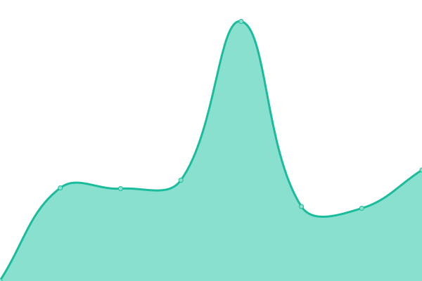

# [📈 Live Status](https://uptime.itzdabbzz.me): <!--live status--> **🟩 All systems operational**

This repository contains the open-source uptime monitor and status page for [ItzDabbzz](ItzDabbzz.me), powered by [Upptime](https://github.com/upptime/upptime).

With [Upptime](https://upptime.js.org), you can get your own unlimited and free uptime monitor and status page, powered entirely by a GitHub repository. We use [Issues](https://github.com/ItzDabbzz/Uptime/issues) as incident reports, [Actions](https://github.com/ItzDabbzz/Uptime/actions) as uptime monitors, and [Pages](https://uptime.itzdabbzz.me) for the status page.

<!--start: status pages-->
<!-- This summary is generated by Upptime (https://github.com/upptime/upptime) -->
<!-- Do not edit this manually, your changes will be overwritten -->
<!-- prettier-ignore -->
| URL | Status | History | Response Time | Uptime |
| --- | ------ | ------- | ------------- | ------ |
|  [Homepage](https://itzdabbzz.me/) | 🟩 Up | [homepage.yml](https://github.com/ItzDabbzz/Uptime/commits/HEAD/history/homepage.yml) | 

 1884ms
     
 | 

<a href="https://uptime.itzdabbzz.me/history/homepage">100.00%</a>
    

|  [Rick Dashboard](https://dashboard.itzdabbzz.me/) | 🟩 Up | [rick-dashboard.yml](https://github.com/ItzDabbzz/Uptime/commits/HEAD/history/rick-dashboard.yml) | 

 272ms
     
 | 

<a href="https://uptime.itzdabbzz.me/history/rick-dashboard">32.78%</a>
    

|  [Rick Pixel](https://place.itzdabbzz.me/) | 🟩 Up | [rick-pixel.yml](https://github.com/ItzDabbzz/Uptime/commits/HEAD/history/rick-pixel.yml) | 

 284ms
     
 | 

<a href="https://uptime.itzdabbzz.me/history/rick-pixel">95.71%</a>
    

|  [Rick MatterMost](https://mm.itzdabbzz.me/) | 🟩 Up | [rick-matter-most.yml](https://github.com/ItzDabbzz/Uptime/commits/HEAD/history/rick-matter-most.yml) | 

 208ms
     
 | 

<a href="https://uptime.itzdabbzz.me/history/rick-matter-most">100.00%</a>
    

|  [Minecraft Hub](68.201.220.219) | 🟩 Up | [minecraft-hub.yml](https://github.com/ItzDabbzz/Uptime/commits/HEAD/history/minecraft-hub.yml) | 

 54ms
     
 | 

<a href="https://uptime.itzdabbzz.me/history/minecraft-hub">67.55%</a>
    

|  [Minecraft Lobby](68.201.220.219) | 🟩 Up | [minecraft-lobby.yml](https://github.com/ItzDabbzz/Uptime/commits/HEAD/history/minecraft-lobby.yml) | 

 53ms
     
 | 

<a href="https://uptime.itzdabbzz.me/history/minecraft-lobby">64.99%</a>
    

<!--end: status pages-->

[**Visit our status website →**](https://uptime.itzdabbzz.me)

## 📄 License

- Powered by: [Upptime](https://github.com/upptime/upptime)
- Code: [MIT](./LICENSE) © [ItzDabbzz](ItzDabbzz.me)
- Data in the `./history` directory: [Open Database License](https://opendatacommons.org/licenses/odbl/1-0/)
